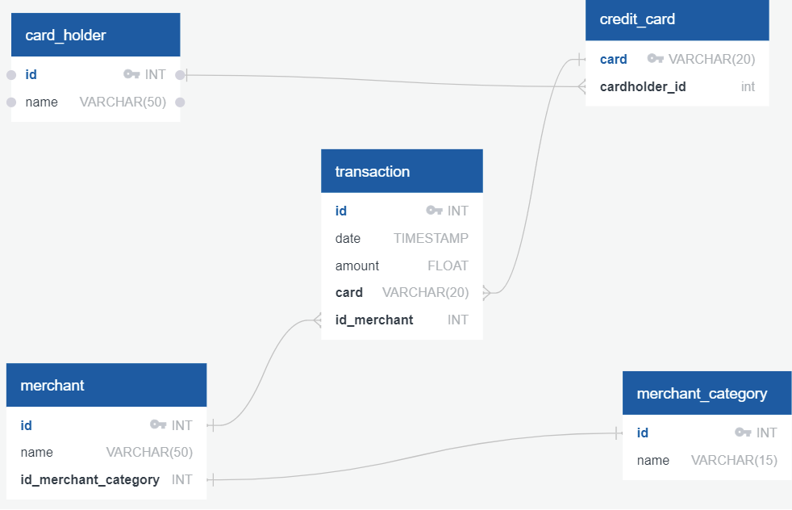

# Looking For Suspicious Transactions
## Overview
In this notebook, we will combine `SQL` and `python` tools to ananlyze historical credit card transactions and consumption pattern in order to identify possible fraudelent transactions. We will accomplish the following tasks. 

* **Data Modeling:** Define a database model to store the credit card transactions data and create a new `PostgreSQL` database using the model. 

* **Data Engineering:** Create a database schema on `PostgreSQL` and populate the database from the `CSV` files provided in the [Data](Data) folder. 

* **Data Analysis:** Analyze the data to identify possible fraudelent transactions trends data, and develop a report. 

## Required Installations
Download [PostgreSQL](https://www.postgresql.org/download/), "a powerful, open source object-relational database system that uses and extends the SQL language combined with many features that safely store and scale the most complicated data workloads"

Using [Conda](https://docs.conda.io/en/latest/) as the package manager, install the following extensions and libraries from `Git Bash` terminal: 

[`SQLAlchemy`](https://pypi.org/project/SQLAlchemy/)
```bash
 pip install SQLAlchemy
 ```

[`Python-dotenv`](https://pypi.org/project/python-dotenv/)
```bash
pip install python-dotenv
```

Follow the provided [`PyViz`](PyVizInstallationGuide.md) installation guide to complete installations. 


## Data Modeling



Inspect the CSV files to create an entity relationship diagram. For example, `a card holder id` can have a one to many relationship to the `credit card` table. Meaning one person can have multiple credit cards.  