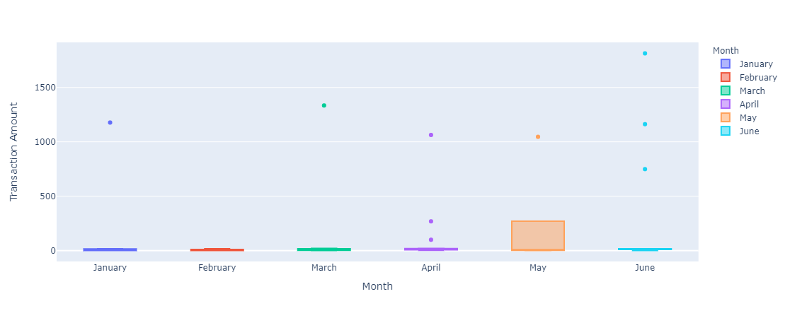

# Looking For Suspicious Transactions
## Overview
In this notebook, we will combine `SQL` and `python` tools to analyze historical credit card transactions and consumption pattern in order to identify possible fraudulent transactions. We will accomplish the following tasks. 

* **Data Modeling:** Define a database model to store the credit card transactions data and create a new `PostgreSQL` database using the model. 

* **Data Engineering:** Create a database schema on `PostgreSQL` and populate the database from the `CSV` files provided in the [Data](Data) folder. 

* **Data Analysis:** Analyze the data to identify possible fraudulent transactions trends data, and develop a report. 

## Required Installations
Download [PostgreSQL](https://www.postgresql.org/download/), "a powerful, open source object-relational database system that uses and extends the SQL language combined with many features that safely store and scale the most complicated data workloads"

Using [Conda](https://docs.conda.io/en/latest/) as the package manager, install the following extensions and libraries from `Git Bash` terminal: 

[`SQLAlchemy`](https://pypi.org/project/SQLAlchemy/)
```bash
 pip install SQLAlchemy
 ```

[`Python-dotenv`](https://pypi.org/project/python-dotenv/)
```bash
pip install python-dotenv
```

Follow the provided [`PyViz`](PyVizInstallationGuide.md) installation guide to complete installations. 


## Data Modeling


Inspect the CSV files to create an entity relationship diagram. For example, `a card holder id` can have a one-to-many relationship to the `credit card` table. Meaning one person can have multiple credit cards.  

## Data Engineering

Use the EDR diagram as a guide to develop a database in `postgreSQL`. Using the query tool and CSV files, create tables and import data. 

For example: 
```SQL
CREATE TABLE card_holder(
    id INT PRIMARY KEY,
    name VARCHAR(50)
);
```

We can also use the `all_tables_seed.sql` files located inside the [Data](Data) folder to insert values after all the  tables have been created.

## Data Analysis

Using the `sqlalchemy` module, we can query the local `postgreSQL` database from the jupyter notebook. Using `pandas`, `plotly` and `hvplot`, we can build a dataframe to run data analysis and create visulizations of customer spending trends. 
#### Box Plot



This box plot helps us visualize anomalies in the customer's spending habits for the first six months of the year. The outliers in the box plot may be the result of fraudulent transactions. 


